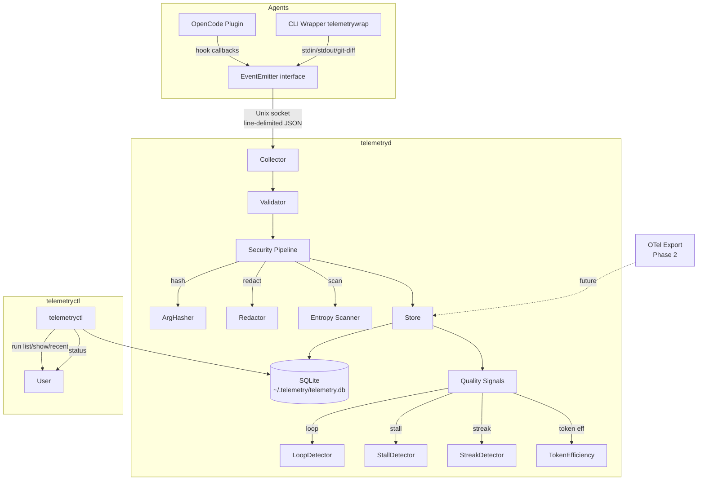

# Design: Agent Telemetry System

## Technical Approach

Local-first observability for CLI LLM agents. Agent plugins emit canonical JSON-L events over a Unix socket to a Go daemon (`telemetryd`) that validates, redacts, hashes, and persists to SQLite. A CLI (`telemetryctl`) queries runs and quality signals. Two emission strategies: native OpenCode plugin (hook callbacks) and CLI wrapper fallback (stdin/stdout inference from `telemetrywrap`). Quality signals (loop, stall, streak detection) computed synchronously on each event write — no background worker. Modeled after SkillVault's existing monolith pattern: `cmd/` entry points wire `internal/` services.

## Architecture Decisions

| Decision | Choice | Rejected | Rationale |
|---|---|---|---|
| Transport | Unix socket (`SOCK_STREAM`) | HTTP (port/auth complexity), gRPC (overkill for local) | Zero config, no auth needed, POSIX permissions isolate access |
| DB driver | `modernc.org/sqlite` (already in `go.mod`) | `mattn/go-sqlite3` (CGo) | Zero CGo → trivial cross-compilation for linux/darwin amd64+arm64 |
| Quality signals | Synchronous on event write | Background worker/goroutine polling | Simpler; no coordination; <10ms detection latency satisfies NFR |
| Wire protocol | Line-delimited JSON (`\n` framing) | Protobuf, msgpack, length-prefixed | Simplest; human-debuggable; no IDL/schema registry needed |
| Hash function | SHA-256(salt + args) | HMAC-SHA256 (unnecessary), bcrypt (too slow) | Deterministic dedup; salt provides domain separation; HMAC MAC property not needed |
| Event model | Envelope {metadata} + {payload} | Flat events | Metadata enables routing, correlation, security tagging, confidence labeling without touching payload |
| Package naming | `internal/agenttelemetry/` (Go convention: no hyphens) | `internal/agent-telemetry/` (proposal name) | Go packages must be valid identifiers; directory follows Go idiom |

## Component Diagram



## Package Layout

```
cmd/telemetryd/          # Daemon entry point: main.go
cmd/telemetryctl/        # CLI entry point: main.go (subcommands)
internal/agenttelemetry/
  event.go               # Event, EventEnvelope types, JSON-L schema
  collector.go           # Collector: Unix socket listener, accept, ack
  validator.go           # Validator: schema validation on ingest
  store.go               # Store: SQLite DDL, CRUD, WAL mode
  hasher.go              # ArgHasher: SHA-256(salt+args) + salt mgmt
  redactor.go            # Redactor: built-in + custom regex patterns
  entropyscanner.go      # Entropy scanner: base64 detection
  loopdetector.go        # LoopDetector: rolling 60s window, args_hash
  stalldetector.go       # StallDetector: wall-clock inactivity check
  streakdetector.go      # StreakDetector: consecutive fail/no-change
  telemetrywrap/         # CLI wrapper fallback binary
    main.go
  plugin/                # Agent-specific plugin impls
    opencode.go          # OpenCode hook adapter
go.mod                   # + otel SDK dep (plumbing only in MVP)
```

## Go Interfaces

```go
// Event is the canonical JSON-L event.
type Event struct {
    EventID          string          `json:"event_id"`          // evt-<uuidv7>
    EventType        string          `json:"event_type"`        // run.started, tool.called, ...
    Timestamp        time.Time       `json:"timestamp"`         // ISO8601
    RunID            string          `json:"run_id"`
    AgentID          string          `json:"agent_id"`
    AgentVersion     string          `json:"agent_version"`
    Source           string          `json:"source"`            // plugin|wrapper|daemon
    CorrelationID    *string         `json:"correlation_id,omitempty"`
    StepID           *string         `json:"step_id,omitempty"`
    RedactionPolicy  string          `json:"redaction_policy"`  // hash-args|none|scanned-warning
    ConfidenceLevel  string          `json:"confidence_level"`  // measured|estimated|heuristic
    Payload          json.RawMessage `json:"payload"`
}

type EventEmitter interface {
    StartRun(ctx context.Context, opts RunOpts) (string, error)
    CompleteRun(ctx context.Context, runID string) error
    FailRun(ctx context.Context, runID string, err error) error
    EmitEvent(ctx context.Context, e Event) error
    EmitEvents(ctx context.Context, events []Event) error
    Close() error
}

type Collector interface {
    Listen(ctx context.Context) error        // bind Unix socket, accept loop
    Ingest(ctx context.Context, raw []byte) error // validate → security → store
    Shutdown(ctx context.Context) error      // drain + close
}

type Store interface {
    SaveRun(ctx context.Context, r AgentRun) error
    SaveEvent(ctx context.Context, e Event) error
    GetRun(ctx context.Context, runID string) (AgentRun, error)
    ListRuns(ctx context.Context, filter RunFilter) ([]AgentRun, error)
    GetRunEvents(ctx context.Context, runID string) ([]Event, error)
    Status(ctx context.Context) (DaemonStatus, error)
    Close() error
}

type ArgHasher interface {
    Hash(args []string) string     // SHA-256(salt + join(args, "\x00"))
    Verify(args []string, hash string) bool
    SaltFingerprint() string       // first 8 hex chars of salt hash
}

type Redactor interface {
    Redact(s string) string        // apply all active patterns
    Patterns() []string            // list active regex patterns
}

type LoopDetector interface {
    Check(call ToolCallRecord) *LoopSignal
}

type TokenCounter interface {
    Estimate(apiResponse json.RawMessage) TokenUsage
}
```

## SQLite Schema DDL

```sql
CREATE TABLE IF NOT EXISTS agent_runs (
    id            TEXT PRIMARY KEY,        -- run-<uuidv7>
    agent_id      TEXT NOT NULL,
    agent_version TEXT NOT NULL DEFAULT '',
    repo_url      TEXT,
    branch        TEXT,
    commit_sha    TEXT,
    workspace     TEXT NOT NULL,
    started_at    DATETIME NOT NULL,
    completed_at  DATETIME,
    status        TEXT NOT NULL DEFAULT 'running'
                  CHECK(status IN ('running','completed','failed')),
    total_tokens  INTEGER DEFAULT 0,
    total_cost_usd REAL DEFAULT 0.0,
    error_type    TEXT,
    error_message TEXT
);

CREATE TABLE IF NOT EXISTS agent_steps (
    id            TEXT PRIMARY KEY,        -- step-<uuidv7>
    run_id        TEXT NOT NULL REFERENCES agent_runs(id),
    step_name     TEXT NOT NULL,
    step_index    INTEGER NOT NULL DEFAULT 0,
    started_at    DATETIME NOT NULL,
    completed_at  DATETIME,
    duration_ms   INTEGER DEFAULT 0
);

CREATE TABLE IF NOT EXISTS tool_calls (
    id            TEXT PRIMARY KEY,        -- call-<uuidv7>
    run_id        TEXT NOT NULL REFERENCES agent_runs(id),
    step_id       TEXT REFERENCES agent_steps(id),
    tool_name     TEXT NOT NULL,
    args_hash     TEXT NOT NULL,           -- SHA-256(salt + args)
    call_index    INTEGER NOT NULL DEFAULT 0,
    started_at    DATETIME NOT NULL,
    completed_at  DATETIME,
    duration_ms   INTEGER DEFAULT 0,
    success       INTEGER DEFAULT 1,       -- 0 or 1
    error_type    TEXT
);

CREATE TABLE IF NOT EXISTS token_usage (
    id                TEXT PRIMARY KEY,
    run_id            TEXT NOT NULL REFERENCES agent_runs(id),
    step_id           TEXT REFERENCES agent_steps(id),
    model             TEXT NOT NULL,
    input_tokens      INTEGER NOT NULL DEFAULT 0,
    output_tokens     INTEGER NOT NULL DEFAULT 0,
    total_tokens      INTEGER NOT NULL DEFAULT 0,
    cost_usd          REAL DEFAULT 0.0,
    estimation_method TEXT NOT NULL DEFAULT 'char-div-4'
                      CHECK(estimation_method IN ('api-response','char-div-4','manual')),
    efficiency_ratio  REAL,               -- output / (input+output); computed on write
    recorded_at       DATETIME DEFAULT CURRENT_TIMESTAMP
);

CREATE TABLE IF NOT EXISTS events (
    id              TEXT PRIMARY KEY,      -- evt-<uuidv7>
    run_id          TEXT NOT NULL,
    event_type      TEXT NOT NULL,
    timestamp       DATETIME NOT NULL,
    source          TEXT NOT NULL DEFAULT 'plugin',
    correlation_id  TEXT,
    step_id         TEXT,
    redaction_policy TEXT NOT NULL DEFAULT 'hash-args',
    confidence_level TEXT NOT NULL DEFAULT 'measured',
    payload         TEXT NOT NULL,         -- JSON text
    created_at      DATETIME DEFAULT CURRENT_TIMESTAMP
);

CREATE INDEX IF NOT EXISTS idx_events_run_id ON events(run_id);
CREATE INDEX IF NOT EXISTS idx_events_event_type ON events(event_type);
CREATE INDEX IF NOT EXISTS idx_events_timestamp ON events(timestamp);
CREATE INDEX IF NOT EXISTS idx_agent_runs_status ON agent_runs(status);

PRAGMA journal_mode=WAL;
PRAGMA synchronous=NORMAL;
```

## Data Flow: Event Ingestion

```
Plugin/Wrapper                    telemetryd (per-client goroutine)
    │                                     │
    │  {"event_id":"evt-01",...}\n        │
    ├────────────────────────────────────►│ [1] bufio.ScanLines → raw JSON
    │                                     │ [2] json.Unmarshal → Event
    │                                     │ [3] Validator: required fields, enum checks
    │                                     │ [4] Redactor.Redact(payload) — regex pass
    │                                     │ [5] ArgHasher.Hash(args) — if tool/command event
    │                                     │ [6] EntropyScanner.Scan(payload) — if high-entropy → flag
    │                                     │ [7] Store.SaveEvent → INSERT INTO events
    │                                     │ [8] Quality signal checks:
    │                                     │     LoopDetector.Check → loop.detected?
    │                                     │     StallDetector.Update → policy.violation?
    │                                     │     StreakDetector.Update → policy.violation?
    │         {"status":"ok"}\n            │
    │◄────────────────────────────────────┤ [9] Ack response
```

## Security Design

- **Salt**: 32 random bytes at `~/.telemetry/salt`, generated on first daemon start, `0600` permissions. Daemon exits code 3 if permissions are too open.
- **Hashing**: `SHA-256(salt + strings.Join(args, "\x00"))` — deterministic dedup without plaintext storage. `ArgHasher.Verify()` for CLI comparison.
- **Redaction**: 4 built-in regexes (OpenAI keys, Bearer tokens, Authorization headers, `--api-key` flags). Custom patterns via `TELEMETRY_REDACTION_PATTERNS` (newline-separated).
- **Prompt storage**: Opt-in only. Default: `prompt_hash` and `prompt_char_count`. `TELEMETRY_STORE_PROMPTS=true` enables body storage, redacted, max 100KB. Oversized (>1MB) rejected with hash-only fallback.
- **Entropy scan**: Best-effort base64 detection (ratio > 0.75, length > 20) → `redaction_policy: scanned-warning`.

## Plugin Design

**OpenCode Plugin** (~200 lines): Implements `EventEmitter`. Assumes OpenCode exposes hook callbacks (pre/post-run, pre/post-step, pre/post-tool) similar to Claude Code hooks. If the surface differs, adapter stays ~200 lines — just maps different callback names. Connects to daemon socket on init, emits 9 event types with proper `correlation_id` chaining.

**CLI Wrapper** (`telemetrywrap --agent <id> -- <command>`): Intercepts stdin/stdout via `os/exec` with pipes. Parses stdout for API `usage` blocks to get measured token counts. Polls `git diff --stat` every 2s for file changes. All events flagged `confidence_level: heuristic`. Cannot detect step boundaries or individual tool calls.

## OpenTelemetry Mapping (Phase 2 Plumbing)

| Telemetry Concept | OTel Concept | Status |
|---|---|---|
| `AgentRun` | Trace (run_id → trace_id) | MVP: stored as run_id; Phase 2: `trace_id = run_id` |
| `Event` with `step_id` | Span (step_id → span_id, correlation_id → parent_span_id) | MVP: correlation_id chain; Phase 2: OpenTelemetry SDK span creation |
| `model.usage` event | Span attribute + metric | MVP: stored as event; Phase 2: OTel metrics counter |
| `loop.detected` event | Span event | MVP: stored as event; Phase 2: `span.AddEvent("loop.detected", ...)` |
| Token usage counters | OTel UpDownCounter | Phase 2 only |

OTel SDK added as `go.mod` dep for plumbing; no export endpoint configured in MVP. `internal/agenttelemetry/otel.go` stub (empty, `//go:build otel` tag gated).

## Testing Strategy

| Layer | What | Approach |
|---|---|---|
| Unit: `event_test.go` | JSON marshal/unmarshal round-trip, required field validation | Table-driven, golden files for JSON-L fixtures |
| Unit: `hasher_test.go` | SHA-256 determinism, salt generation, Verify correctness | Temp dir per test, `t.TempDir()` |
| Unit: `redactor_test.go` | Built-in patterns catch API keys, custom patterns compile | Regex test vectors with known keys |
| Unit: `loopdetector_test.go` | 3 identical → detect, 2 identical → no, window expiry → no | Inject `ToolCallRecord` sequence, assert `LoopSignal` |
| Unit: `stalldetector_test.go` | No events for 61s → violation, completed run → no | `time.Now()` stub for deterministic clock |
| Integration: `collector_test.go` | End-to-end: plugin → daemon → SQLite → query | Start daemon on temp socket, send events, query via Store |
| Integration: `mock_plugin_test.go` | Mock `EventEmitter` sends all 19 event types, verifies DB rows | `go test -tags integration` |
| E2E: `telemetrywrap_test.go` | `telemetrywrap --agent test -- echo hello` → DB has run | Requires `go build` of wrapper binary; skip in `-short` |

## Deployment / Operation

```bash
# Start daemon
telemetryd &
# Default socket: $XDG_RUNTIME_DIR/telemetryd.sock or /tmp/telemetryd.sock

# Enable plugin
export TELEMETRY_ENABLED=true
export TELEMETRY_SOCKET=/run/user/1000/telemetryd.sock

# Query
telemetryctl run list --limit 10
telemetryctl run show run-abc123
telemetryctl status
```

**Env vars**: `TELEMETRY_ENABLED`, `TELEMETRY_SOCKET`, `TELEMETRY_STORE_PROMPTS`, `TELEMETRY_REDACTION_PATTERNS`. DB path: `~/.telemetry/telemetry.db`. Data dir created on first daemon start.

## Error Handling

| Error | Recovery |
|---|---|
| Socket bind fails (addr in use) | Retry 3x with 1s backoff, then fatal exit code 1 |
| DB locked (SQLITE_BUSY) | Retry 3x exponential (10ms, 100ms, 1s), drop event on final failure |
| Malformed JSON from client | Log warning (raw truncated to 256 chars), return error ack, continue |
| DB file perms wrong | Exit code 2, log path and perms |
| Salt file missing on restart | Exit code 3, instruct user to restore or delete DB |
| Salt file perms too open | Exit code 3, log expected 0600 |
| Redaction regex compile error | Log error, skip pattern, use built-ins only |
| Daemon SIGTERM | Drain pending events (5s timeout), close socket, exit 0 |
| Plugin daemon unreachable | Plugin logs warning, returns error; agent continues without telemetry |
| Plugin daemon disconnects mid-run | Buffer up to 1000 events in memory, reconnect; drop oldest if buffer full |

## Performance

- **Target**: 100 events/sec sustained; event validation < 1ms
- **WAL mode**: Concurrent reads during writes; no writer starvation
- **Per-client goroutine**: One goroutine per socket connection, `bufio.Scanner` for line reading
- **Quality signals**: In-memory sliding window (max 1000 recent calls per run), LRU eviction; detection < 10ms
- **Wrapper RSS**: < 50MB (just `os/exec` + pipe copying + JSON marshal)

## Threat Matrix

| Boundary | Applicability | Design Response | Planned RED Tests |
|---|---|---|---|
| Git repository selection (`git -C`) | Applicable | Resolve `Workspace` from `os.Getwd()` at plugin init; pass `--` after path; non-git dirs → null git fields (not error) | Test: non-git dir, missing git binary, `--` injected in path arg |
| Documentation-like paths | N/A | No file content classification/execution; `git diff --stat` captures paths passively | — |
| Commit state | N/A | Read-only `git diff --stat`; no staging/committing | — |
| Push state | N/A | No push/remote write; `git remote` is read-only context | — |
| PR commands | N/A | No PR automation | — |

## Open Questions

- [ ] Exact OpenCode hook callback surface (names, signatures) — adapter stays ~200 lines regardless
- [ ] `uuidv7` generation: use `github.com/google/uuid` (already indirect dep via `go.sum`) or implement inline
