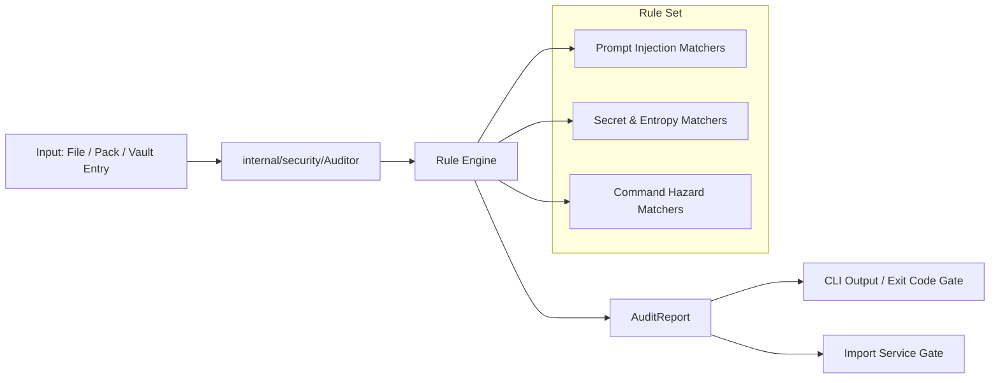

# Design: Security Audit Engine & CLI Import Gate

## Technical Approach

### Components

1. **`internal/security/audit.go`**:
   - `Auditor`: Main engine with regex compilation at init.
   - `Finding`: Data model with `RuleID`, `Category`, `Severity`, `Description`, `MatchSnippet`, `LineNumber`, `Suggestion`.
   - `AuditReport`: Container with summary counts and list of findings.
   - Methods:
     - `AuditContent(target string, content string) AuditReport`
     - `AuditFile(path string) (AuditReport, error)`
     - `AuditPack(data []byte) (AuditReport, error)`
     - `AuditVaultEntries(entries []domain.Entry) (AuditReport, error)`

2. **`internal/app/audit.go`**:
   - `AuditService`: Coordinates database queries with the security auditor to scan active vault entries.

3. **`internal/cli/flags.go`**:
   - `ParseAuditFlags(args []string) (AuditFlags, error)`
   - Update `ParseImportFlags` to include `StrictAudit bool` (`--strict-audit`).

4. **`cmd/skillvault/main.go`**:
   - Case `"audit"`: Executes vault, pack, or file audit and formats output.
   - Case `"import"`: If `--strict-audit` is set, calls `Auditor.AuditPack()` or `Auditor.AuditFile()` before persisting to SQLite.
