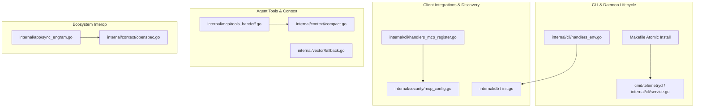

# Design: Agentic DX & Tooling Suite

## Architecture Overview

## Component Details

### 1. Makefile & Daemon Lifecycle (`cmd/`, `Makefile`)
- Update `install` and `install-telemetry` targets to use `install -m 755` or `cp --remove-destination`.
- In `internal/cli/`, implement `telemetry service` handling process signals (SIGTERM, PID file check in `~/.skillvault/telemetryd.pid` or `/run/user/<uid>/telemetryd.pid`) and optional systemd user unit creation.

### 2. MCP Registration (`internal/cli/handlers_mcp_register.go`)
- Create `RegisterMCPConfig(client string, binPath string) (Report, error)`.
- Support:
  - JSON clients (`opencode.json`, `mcp_config.json`, `claude_desktop_config.json`): Parse with `encoding/json` into generic map, insert/update key, format with indentation.
  - TOML client (`config.toml` for Codex): Detect `[mcp_servers.skillvault]` block, update or append without reformatting unrelated blocks.
- Run `AuditConfigFile` immediately following write.

### 3. Topology Discovery & Symlinks (`internal/cli/handlers_env.go`)
- Fast command `skillvault env`:
  - Resolve paths without loading heavy vector models or full SQLite database connections.
  - Returns `vault_home`, `db_path`, `socket_path`, `exports_path`, `telemetry_db`, `binary_path`.
- In `internal/app/setup.go`:
  - After creating or verifying `vault.db`, ensure `os.Symlink("vault.db", filepath.Join(home, "skillvault.db"))`.

### 4. Agentic Handoffs & Context Compression (`internal/mcp/`, `internal/context/`)
- Tools `save_handoff` and `get_handoff`:
  - Built on top of `EntryService` with `Purpose: "STATE"` and tag `handoff`.
  - Structured fields: `task_id`, `step_summary`, `artifacts_produced`, `next_steps`, `blocking_issues`.
- Compact Context Formatter:
  - High-density YAML-like output reducing JSON brackets and quotes.
- Vector Fallback:
  - In `search_entries`, if vector search is requested but word embeddings are absent, log warning and execute FTS5 query with BM25 ranking.

### 5. Telemetry Live Activity & Hooks (`cmd/telemetryctl/`, `internal/agenttelemetry/`)
- `telemetryctl live`:
  - Connects to SQLite store or Unix socket and prints running agents, latest signals (loops, stalls, policy violations).
- `skillvault telemetry install-hooks`:
  - Writes hook wrappers for OpenCode and Codex to monitor CLI tool calls.

### 6. Engram & OpenSpec Interoperability (`internal/app/sync_engram.go`)
- `sync-engram`:
  - Connects to Engram's SQLite database (`memories.sqlite` or `~/.codex/memories_1.sqlite`).
  - Upserts observations into SkillVault with tag `engram` and proper deduplication.
- OpenSpec Indexing in `get-context`:
  - Checks if `openspec/changes` exists in current directory or git root.
  - In `mode: planning`, appends active change summary into the context pack.
