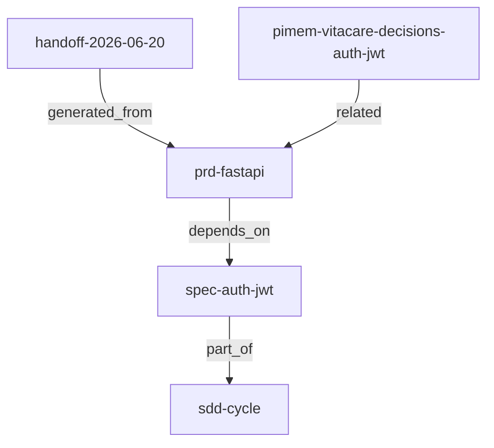

# SkillVault — Spec v1 Patch: `entry_refs`, `handoff`, `external_ref` + pi-memory integration

> **Base spec:** `skillvault-spec-v1.md`
> **Patch status:** Proposed — pending implementation
> **Autor del patch:** Arquitectura con el Gentleman (Pi session 2026-06-20)
> **Compatibilidad:** Respeta todas las reglas del spec base (reglas 5 y 6 incluidas: zero frameworks, zero LLM, zero runtime agentic).
> **Cortes:** v1-alpha add-on (Sprints 1-3) · v1-final (Sprint 4) · v2 (roadmap)

---

## 0. Resumen ejecutivo

Este patch sumariza y extiende el spec v1 con tres capacidades complementarias sin romper el contrato minimalista:

1. **`entry_refs`** — grafo dirigido de relaciones entre entries (generalización de `project_refs`), con traversión por CTE recursivo y detección de ciclos. No es una graph DB. No usa LLM. No usa frameworks.
2. **`type=handoff`** — handoff entre sesiones como artefacto de biblioteca persistido, referenciado y buscable. Implementa el patrón del skill `handoff` de Matt Pocock pero dentro de SkillVault, no como archivo efímero en `/tmp`.
3. **`external_ref` + shadow entries + `memory index`** — integración unidireccional pi-memory-md → SkillVault. pi-memory sigue siendo la fuente de verdad humana (git, diff, PR review); SkillVault la indexa para FTS5 + grafo de refs. No es sync bidireccional vivo (eso es v2 roadmap).

**Principio rector:** pi-memory-md y SkillVault son dominios complementarios, no competitivos. SkillVault no reemplaza pi-memory — la indexa. Engram (memoria episódica) queda fuera de este patch por diseño: es otra categoría.

### Modelo de integración

```
┌─────────────────────────────────────────────────────────┐
│  pi-memory-md (git repo)                                │
│  Markdown curado, humano-readable, versionado           │
│  ├── vitacare/core/USER.md                              │
│  ├── vitacare/core/project/auth-jwt-decision.md         │
│  ├── vitacare/docs/conventions.md                       │
│  └── vitacare/archive/...                               │
│         │                                               │
│         │  skillvault memory index                      │
│         │  (parse frontmatter → upsert shadow entries)  │
│         ▼                                               │
├─────────────────────────────────────────────────────────┤
│  SkillVault (SQLite)                                    │
│  ├── entries nativos: skill/prompt/workflow/agent       │  ← artefactos operativos
│  ├── shadow entries: context/note + external_ref ──────►│  ← apuntan al .md en git
│  ├── entry_refs: grafo de relaciones                    │
│  └── FTS5 cubre AMBOS                                   │
└─────────────────────────────────────────────────────────┘
```

---

## 1. Edición a §10.1 — sumar `handoff` al CHECK de tipos

**Diff sobre el spec base:**

```diff
- Tipos válidos: skill, agent, workflow, prompt, context, note
+ Tipos válidos: skill, agent, workflow, prompt, context, note, handoff
```

**Nueva fila en la tabla de tipos:**

| `handoff` | Documento de transferencia entre sesiones. Resume estado actual, next session focus, suggested skills y blockers. Referencia artefactos via `entry_refs`. No duplica contenido de otros entries ni de artefactos externos (PRDs, specs, commits) — los referencia. |

**Nueva regla al final de §10.1:**

> Handoff entries no duplican contenido de otros entries ni de artefactos externos (PRDs, specs, commits). Los referencian via `entry_refs` con `ref_type=generated_from` o `related`. El `content` del handoff contiene únicamente: estado actual, next session focus, suggested skills y blockers. Implementa el patrón del skill `handoff` de Matt Pocock pero persistido, buscable y referenciado dentro de SkillVault.

---

## 2. Nueva §10.6 — `external_ref` en entries (integración pi-memory)

**Campo nuevo en tabla `entries` (editar §11.3):**

```sql
ALTER TABLE entries ADD COLUMN external_ref TEXT;
```

**Reglas:**

- `external_ref` es un path relativo a un repositorio externo versionado (ej: pi-memory-md repo).
- Formato: `{project-slug}/{path-relativo}.md`.
- Si `external_ref` no es NULL, el entry es un **shadow entry**: indexa contenido externo para FTS5, pero la fuente de verdad humana es el archivo externo.
- Shadow entries usan `type IN ('context','note','handoff')` — nunca `skill`/`prompt`/`workflow`/`agent` (esos son nativos de SkillVault).
- `content` del shadow entry: por default, `description + primer heading + primer párrafo` del .md. No el body completo, para evitar duplicación grande. Decisión refinada en §17-ter.
- Tags del shadow entry se heredan del frontmatter `tags` del .md, más un tag fijo `pimem` para distinguir.
- `project_id` del shadow entry se mapea desde la carpeta top-level del repo pi-memory.
- Upsert de un shadow entry con `external_ref` set y `source_entry_id` NULL. Re-indexar es idempotente (mismo `external_ref` → mismo `id` → upsert).

**ID convención para shadow entries:**

```text
pimem-{project-slug}-{path-slugified}
ej: pimem-vitacare-core-project-auth-jwt-decision
```

---

## 3. Nueva §10.7 — `entry_refs` (grafo de relaciones)

Generaliza `project_refs` (§18, v1-final) a un adjacency list genérico. `project_refs` queda como caso especializado sobre `entry_refs` o se depreca a favor de este.

**Schema (editar §11, sumar tabla):**

```sql
CREATE TABLE entry_refs (
  source_id   TEXT NOT NULL REFERENCES entries(id) ON DELETE CASCADE,
  target_id   TEXT NOT NULL REFERENCES entries(id) ON DELETE CASCADE,
  ref_type    TEXT NOT NULL CHECK(ref_type IN (
    'depends_on','uses','extends','supersedes',
    'part_of','related','handoff_of','generated_from'
  )),
  label       TEXT,
  active      INTEGER DEFAULT 1,
  created_at  DATETIME DEFAULT CURRENT_TIMESTAMP,
  PRIMARY KEY (source_id, target_id, ref_type)
);
CREATE INDEX idx_entry_refs_source ON entry_refs(source_id);
CREATE INDEX idx_entry_refs_target ON entry_refs(target_id);
CREATE INDEX idx_entry_refs_type ON entry_refs(ref_type);
```

**Reglas:**

- Grafo dirigido: `source_id → target_id` con `ref_type` semántico.
- `ref_type` semántica:
  - `depends_on`: source necesita target para funcionar (skill depende de prompt).
  - `uses`: source invoca target (agent usa workflow).
  - `extends`: source especializa target (skill-v2 extends skill-v1).
  - `supersedes`: source reemplaza target (skill-v2 supersedes skill-v1, target queda archived).
  - `part_of`: source es componente de target. Reservado para relaciones fuera de series/workflows (series usan `series_entries`, workflows usan `workflow_steps`). En la práctica se usa poco en v1; dejarlo en el CHECK pero documentar la preferencia por las composiciones nativas.
  - `related`: relación genérica sin semántica fuerte.
  - `handoff_of`: handoff entry refiere al trabajo de una sesión/serie.
  - `generated_from`: entry deriva de otro (handoff generado_from spec; copy_entry generated_from source).
- Sin ciclos para `depends_on` / `part_of` / `supersedes` (validar en store, no en DB).
- `part_of` y `series_entries`: **no duplicar**. `series_entries` ya ordena entries en series. `part_of` queda para relaciones ad-hoc fuera de series/workflows.
- Soft delete via `active=0`, consistente con el resto.

---

## 4. Nueva §17-bis — Traversión con CTE recursivo

No es tabla nueva, es capability del store. Documentar el patrón:

```sql
-- Dependencias transitivas de un entry (profundidad máx 10)
WITH RECURSIVE deps AS (
  SELECT source_id, 1 AS depth FROM entry_refs
  WHERE target_id = ?1 AND ref_type = 'depends_on' AND active = 1
  UNION ALL
  SELECT e.source_id, d.depth + 1
  FROM entry_refs e JOIN deps d ON e.target_id = d.source_id
  WHERE e.ref_type = 'depends_on' AND e.active = 1 AND d.depth < 10
)
SELECT source_id, depth FROM deps;

-- Backlinks: qué entries referencian a X
SELECT source_id, ref_type FROM entry_refs
WHERE target_id = ?1 AND active = 1;

-- Línea de sucesión: supersedes chain
WITH RECURSIVE chain AS (
  SELECT target_id AS entry_id, 1 AS depth FROM entry_refs
  WHERE source_id = ?1 AND ref_type = 'supersedes' AND active = 1
  UNION ALL
  SELECT e.target_id, c.depth + 1
  FROM entry_refs e JOIN chain c ON e.source_id = c.entry_id
  WHERE e.ref_type = 'supersedes' AND e.active = 1 AND c.depth < 10
)
SELECT entry_id, depth FROM chain;
```

**Regla:**

- Profundidad máx hard-coded 10 para evitar ciclos infinitos.
- Detección de ciclos en `depends_on`/`part_of`/`supersedes`: el store valida con un CTE antes de aceptar el upsert de un `entry_ref`. Si el insert cierra un ciclo, rechaza con error `cycle_detected`.

---

## 5. Nueva §20.5 — MCP tools nuevas (v1-alpha add-on)

Sumar a las 11 de alpha:

1. `upsert_entry_ref` — crea/actualiza una arista `entry_refs`. Params: `source_id`, `target_id`, `ref_type`, `label?`. Valida cycle si `ref_type` es cycle-prone.
2. `list_entry_refs` — lista aristas. Filtros: `source_id?`, `target_id?`, `ref_type?`, `active?`, `include_archived?`.
3. `get_entry_graph` — traversión: dado un entry_id y un ref_type, devuelve nodos alcanzables con profundidad. Params: `entry_id`, `ref_type?` (default all), `direction` (outgoing/incoming/both, default both), `max_depth` (default 3, máx 10).

(`memory index` queda solo en CLI, no MCP — consistente con §20.3 que dice import/export son CLI-only.)

---

## 6. Nueva §21.3 — CLI comandos nuevos

```bash
# v1-alpha add-on
skillvault entry ref add <source_id> <target_id> <ref_type> [--label <txt>]
skillvault entry ref list [--source <id>] [--target <id>] [--type <ref_type>] [--include-archived]
skillvault entry ref remove <source_id> <target_id> <ref_type>

skillvault memory index [--path <pi-memory-dir>] [--project <id>]
skillvault memory reindex [--project <id>]
skillvault memory list-external [--project <id>]

# v1-final
skillvault graph --entry <id> [--depth <n>] [--format mermaid|json|dot] [--type <ref_type>] [--direction outgoing|incoming|both]
```

---

## 7. Nueva §17-ter — Integración pi-memory (`memory index`)

**Comando:** `skillvault memory index --path <pi-memory-dir> --project <project_id>`

**Algoritmo:**

1. Escanear `**/*.md` bajo `--path`.
2. Para cada .md:
   a. Parsear frontmatter YAML (bloque entre `---` y `---`). Parser mínimo manual: keys `description`, `tags` (lista), `created`, `updated`. Sin dependencia externa — ~60 líneas con `strings.Split` + strings.TrimSpace. (Si la complejidad crece, `gopkg.in/yaml.v3` es la única excepción aceptable a la regla 5, documentada en ADR-14.)
   b. Mapear carpeta → `type`:
      - `**/core/**` → `context`
      - `**/archive/**` → `note` + flag archived (entry `active=0` tras primer index; o tag `archived`)
      - todo lo demás → `note`
   c. Slugificar path relativo → entry `id`: `pimem-{project}-{path-slugified}`.
   d. Upsert entry con `external_ref = {path-relativo}.md`, `content = description + primer heading + primer párrafo` (no body completo, para evitar duplicación), `tags = frontmatter.tags + ["pimem"]`, `project_id = --project`.
3. Para cada .md, parsear `[[wikilinks]]` (si los usás — ver §17-ter.bis opcional) o frontmatter `links:` → crear `entry_refs` con `ref_type=related` entre shadow entries.
4. Marcar shadow entries que ya no existen en pi-memory (archivo borrado/movido) como `active=0` (soft delete, consistente con §15). No hard delete nunca.

**Reglas:**

- Idempotente: re-correr no duplica, actualiza.
- Transaccional por .md (un .md fallido no rompe el lote).
- `memory reindex` = `memory index` + purge de shadow entries huérfanas (marcadas active=0).
- `memory list-external` lista shadow entries con `external_ref` no NULL.
- El path de pi-memory se resuelve desde settings de pi-memory-md (`.pi/settings.json` `repoUrl` + `localPath`) o se pasa explícito. Si no se encuentra, error claro, no asume default.

### §17-ter.bis — Wikilinks opcionales

Si adoptás la convención `[[target-slug]]` en pi-memory (Camino B), `memory index` los parsea y crea `entry_refs` con `ref_type=related` entre shadow entries. El target se resuelve slug→entry_id buscando shadow entries con matching path-slug. Si no encuentra target, deja el ref pendiente (no falla) y lo reporta en `missing_targets`.

Esto es **opcional** — si pi-memory no usa wikilinks, se omite. Pero habilitarlo cuesta ~20 líneas más en el parser.

---

## 8. Nueva §22.3 — `graph` CLI (v1-final)

```bash
skillvault graph --entry prd-fastapi --depth 3 --format mermaid
```

**Output Mermaid:**



**Formatos:** `mermaid` (default, render GitHub nativo), `json` (`{nodes:[], edges:[]}`), `dot` (Graphviz).

**Reglas:**

- Respeta `active=1` por default; `--include-archived` para ver todo.
- `--type <ref_type>` filtra aristas.
- `--direction outgoing|incoming|both` (default both).
- Profundidad default 3, máx 10.

---

## 9. Edición a §27.1 — Tests obligatorios nuevos (v1-alpha)

Sumar a los tests obligatorios existentes:

**entry_refs:**

- `upsert_entry_ref` crea arista source→target con ref_type.
- Rechaza ref_type inválido.
- Rechaza cycle en `depends_on` (insertar A→B, B→C, rechazar C→A).
- `list_entry_refs` filtra por source/target/type.
- Soft delete (`active=0`) oculta por default.
- Cascade delete: borrar source o target borra aristas.

**handoff entries:**

- `upsert_entry` con `type=handoff` funciona.
- `search_entries` filtra `type=handoff`.
- Handoff con `external_ref` NULL es válido.
- Handoff referenciado via `entry_refs` con `generated_from` se recupera con `get_entry_graph`.

**external_ref / shadow entries:**

- `upsert_entry` con `external_ref` set crea shadow entry.
- Shadow entry con `external_ref` y `type=skill` es rechazado (solo context/note/handoff).
- `memory index` parsea .md con frontmatter y crea shadow entry con tags heredados.
- `memory index` idempotente: segunda corrida no duplica.
- `memory index` con .md sin frontmatter usa fallback (primer heading como name, body como content).
- `memory reindex` marca active=0 shadow entries cuyo .md fue borrado.
- `search_entries` devuelve shadow entries mezcladas con nativas.

**memory index edge cases:**

- .md con frontmatter malformado: error reportado, no rompe lote.
- Wikilink `[[target]]` sin target existente: reportado en `missing_targets`, no falla.

---

## 10. Edición a §28.1 — Done v1-alpha, sumar

- [ ] `entry_refs` tabla + upsert/list/remove.
- [ ] Cycle detection en `depends_on`/`part_of`/`supersedes`.
- [ ] `type=handoff` en CHECK + tests.
- [ ] `external_ref` campo en entries.
- [ ] Shadow entry validation (type IN context/note/handoff).
- [ ] `memory index` CLI con parser frontmatter minimal.
- [ ] `memory reindex` con purge de huérfanos.
- [ ] MCP `upsert_entry_ref`, `list_entry_refs`, `get_entry_graph`.
- [ ] Tests obligatorios nuevos pasan.

---

## 11. Edición a §28.2 — Done v1-final, sumar

- [ ] `skillvault graph --format mermaid|json|dot`.
- [ ] Wikilink parsing opcional en `memory index`.

---

## 12. Edición a §31 — Roadmap, sumar v2

- **v2.1 — Git Sync**: sync bidireccional pi-memory ↔ SkillVault con watcher.
- **v2.2 — Embeddings opcionales**: `text-embedding-3-small` + cosine para búsqueda semántica sobre entries (FTS5 + vector híbrido).

---

## 13. Nueva §30.11 — ADRs nuevos

1. **ADRs nuevos:**
    - ADR-11: `entry_refs` como grafo dirigido con CTE recursivo, no graph DB.
    - ADR-12: `external_ref` + shadow entries para integrar pi-memory sin sync vivo.
    - ADR-13: `type=handoff` como artefacto de biblioteca, no archivo temporal.
    - ADR-14: Parser frontmatter minimal vs `yaml.v3` (decisión de dependencia).

---

## 14. Secuenciamiento de implementación

1. **Sprint 1 (v1-alpha add-on, núcleo)**: `entry_refs` tabla + `upsert/list/remove` + cycle detection + `type=handoff`. Tests. ~1-2 días.
2. **Sprint 2 (v1-alpha add-on, integración)**: `external_ref` campo + shadow entry validation + `memory index`/`reindex`/`list-external` CLI + frontmatter parser. Tests. ~2-3 días.
3. **Sprint 3 (v1-alpha add-on, MCP)**: `upsert_entry_ref`, `list_entry_refs`, `get_entry_graph` MCP tools. Contract tests. ~1 día.
4. **Sprint 4 (v1-final)**: `skillvault graph --format mermaid/json/dot`. Wikilink parsing opcional. ~1-2 días.
5. **v2 roadmap**: sync bidireccional vivo, embeddings opcionales.

---

## 15. Código esencial — lo mínimo para que arranque

### 15.1 Schema diff (`internal/db/migrations/002_refs_and_external.sql`)

```sql
-- 002: entry_refs + external_ref + handoff type

ALTER TABLE entries ADD COLUMN external_ref TEXT;

-- Nota SQLite: el CHECK(type IN ...) no se puede ALTER.
-- Si 001_init.sql ya está congelado, crear 003_rebuild_entries_with_handoff.sql
-- que dropee+recrear entries con el nuevo CHECK incluyendo 'handoff'.
-- Si 001_init.sql todavía no lanzó, editar directamente y bump versión de migración.

CREATE TABLE entry_refs (
  source_id   TEXT NOT NULL REFERENCES entries(id) ON DELETE CASCADE,
  target_id   TEXT NOT NULL REFERENCES entries(id) ON DELETE CASCADE,
  ref_type    TEXT NOT NULL CHECK(ref_type IN (
    'depends_on','uses','extends','supersedes',
    'part_of','related','handoff_of','generated_from'
  )),
  label       TEXT,
  active      INTEGER DEFAULT 1,
  created_at  DATETIME DEFAULT CURRENT_TIMESTAMP,
  PRIMARY KEY (source_id, target_id, ref_type)
);
CREATE INDEX idx_entry_refs_source ON entry_refs(source_id);
CREATE INDEX idx_entry_refs_target ON entry_refs(target_id);
CREATE INDEX idx_entry_refs_type ON entry_refs(ref_type);
```

### 15.2 Cycle detection (`internal/app/entry_refs.go`)

```go
func (s *EntryRefService) UpsertRef(ctx context.Context, src, tgt, refType, label string) error {
    if !cycleProne(refType) {
        // related, handoff_of, generated_from, uses, extends: sin validación de ciclo
        return s.store.UpsertEntryRef(ctx, src, tgt, refType, label)
    }
    // cycleProne: depends_on, part_of, supersedes
    // Verificar que tgt no alcance a src transitivamente
    reachable, err := s.store.ReachableRefs(ctx, tgt, refType, 10)
    if err != nil { return err }
    if contains(reachable, src) {
        return fmt.Errorf("cycle_detected: %s ya es alcanzable desde %s via %s", src, tgt, refType)
    }
    return s.store.UpsertEntryRef(ctx, src, tgt, refType, label)
}

func cycleProne(refType string) bool {
    switch refType {
    case "depends_on", "part_of", "supersedes":
        return true
    default:
        return false
    }
}
```

`ReachableRefs` usa el CTE recursivo de §4.

### 15.3 Frontmatter parser minimal (`internal/vars/frontmatter.go` o `internal/app/memory_index.go`)

```go
type Frontmatter struct {
    Description string
    Tags        []string
    Created     string
    Updated     string
    Links       []string // para [[wikilinks]] opcional
}

var wikilinkRe = regexp.MustCompile(`\[\[([^\]]+)\]\]`)

func parseFrontmatter(content string, parseWikilinks bool) (Frontmatter, string, error) {
    var fm Frontmatter
    if !strings.HasPrefix(content, "---\n") {
        return fm, content, nil // sin frontmatter, fallback
    }
    end := strings.Index(content[4:], "\n---\n")
    if end < 0 { return fm, content, errors.New("frontmatter not closed") }
    block := content[4 : 4+end]
    body := content[4+end+5:]
    for _, line := range strings.Split(block, "\n") {
        line = strings.TrimSpace(line)
        if line == "" || strings.HasPrefix(line, "#") { continue }
        if strings.HasPrefix(line, "tags:") {
            rest := strings.TrimSpace(strings.TrimPrefix(line, "tags:"))
            if rest != "" && !strings.HasPrefix(rest, "[") {
                fm.Tags = strings.Fields(rest)
            } else if strings.HasPrefix(rest, "[") {
                fm.Tags = parseInlineList(rest)
            }
            continue
        }
        if strings.HasPrefix(line, "- ") {
            fm.Tags = append(fm.Tags, strings.Trim(line[2:], "\"'"))
            continue
        }
        if idx := strings.Index(line, ":"); idx > 0 {
            key := strings.TrimSpace(line[:idx])
            val := strings.TrimSpace(strings.Trim(line[idx+1:], "\"'"))
            switch key {
            case "description": fm.Description = val
            case "created": fm.Created = val
            case "updated": fm.Updated = val
            }
        }
    }
    if parseWikilinks {
        for _, m := range wikilinkRe.FindAllStringSubmatch(body, -1) {
            fm.Links = append(fm.Links, m[1])
        }
    }
    return fm, body, nil
}
```

No es un parser YAML completo, pero cubre el frontmatter de pi-memory-md (description, tags, created, updated — según `memory-write.sh`). Si pi-memory empieza a usar frontmatter más complejo, ADR-14 decide si sumar `yaml.v3`.

### 15.4 `memory index` sketch (`internal/app/memory_index.go`)

```go
func (s *MemoryIndexService) Index(ctx context.Context, memDir, projectID string, parseWikilinks bool) (IndexResult, error) {
    var result IndexResult
    err := filepath.Walk(memDir, func(path string, info os.FileInfo, err error) error {
        if err != nil || info.IsDir() || !strings.HasSuffix(path, ".md") { return err }
        rel, _ := filepath.Rel(memDir, path)
        content, err := os.ReadFile(path)
        if err != nil { result.Failed = append(result.Failed, rel); return nil }
        fm, body, err := parseFrontmatter(string(content), parseWikilinks)
        if err != nil { result.Failed = append(result.Failed, rel); return nil }
        entryType := mapFolderToType(rel) // core/* -> context, archive/* -> note, else note
        id := "pimem-" + projectID + "-" + slugify(rel)
        name := fm.Description
        if name == "" { name = firstHeading(body) }
        entryContent := fm.Description + "\n" + firstParagraph(body)
        tags := append(fm.Tags, "pimem")
        isArchived := strings.Contains(rel, "archive/")
        if isArchived { tags = append(tags, "archived") }
        e := Entry{
            ID: id, Name: name, Type: entryType, ProjectID: projectID,
            Content: entryContent, Tags: tags, ExternalRef: rel,
            Active: !isArchived,
        }
        if err := s.store.UpsertEntry(ctx, e, e.Tags, nil); err != nil {
            result.Failed = append(result.Failed, rel); return nil
        }
        result.Indexed = append(result.Indexed, id)
        for _, link := range fm.Links {
            targetID := resolveWikilink(ctx, s.store, link, projectID)
            if targetID == "" { result.MissingTargets = append(result.MissingTargets, link); continue }
            s.store.UpsertEntryRef(ctx, id, targetID, "related", "wikilink")
        }
        return nil
    })
    if err == nil { err = s.store.DeactivateOrphanShadows(ctx, projectID, result.Indexed) }
    return result, err
}
```

### 15.5 `graph` CLI (`internal/cli/commands.go`, v1-final)

```go
// skillvault graph --entry <id> --depth 3 --format mermaid
func cmdGraph(args []string) error {
    entryID := flagArg(args, "--entry")
    depth := flagInt(args, "--depth", 3)
    format := flagArg(args, "--format", "mermaid")
    nodes, edges, err := app.GetEntryGraph(ctx, entryID, depth)
    if err != nil { return err }
    switch format {
    case "mermaid":
        fmt.Println("graph TD")
        for _, e := range edges {
            fmt.Printf("  %s -->|%s| %s\n", e.Source, e.RefType, e.Target)
        }
    case "json":
        json.NewEncoder(os.Stdout).Encode(map[string]any{"nodes": nodes, "edges": edges})
    case "dot":
        fmt.Println("digraph G {")
        for _, e := range edges {
            fmt.Printf("  %s -> %s [label=%q];\n", e.Source, e.Target, e.RefType)
        }
        fmt.Println("}")
    }
    return nil
}
```

---

## 16. Qué gana cada parte del stack con este patch

| Componente | Antes | Después del patch |
|---|---|---|
| **SkillVault** | Biblioteca plana de entries | Biblioteca + grafo de refs + handoff persistido |
| **pi-memory-md** | Markdown en git, aislado de SkillVault | Indexado en SkillVault, FTS5 cubre ambos, refs cruzadas |
| **Handoff** | `/tmp` efímero (skill Matt Pocock) | Entry `type=handoff` referenciado, buscable, reutilizable |
| **Grafo de rels** | No existía | `entry_refs` + CTE recursivo, cero graph DB |
| **Visualización** | No existía | `graph --format mermaid` render GitHub |
| **Engram** | Memoria episódica, separada | Sigue separada (es episódica, no biblioteca) — complementaria |

**Engram queda fuera de este patch deliberadamente.** Engram es memoria episódica (`mem_save`/`mem_session_summary`/`mem_timeline`), SkillVault es biblioteca de artefactos. Se comunican via el agente: Engram guarda *qué pasó*, SkillVault guarda *qué correr* y ahora también *qué decisión quedó documentada* (via shadow entries de pi-memory). No hay merge de sistemas — hay división de dominios.

---

## 17. No-go explícito

Estas cosas **no** están en este patch y deben resistirse si aparecen en implementación:

- ❌ Sync bidireccional vivo pi-memory ↔ SkillVault (es v2 roadmap, requiere watcher + merge).
- ❌ Extracción automática de entidades/facts con LLM (eso es Graphiti, otro dominio).
- ❌ Bi-temporalidad de hechos con validez windows (eso es Graphiti, otro dominio).
- ❌ Neo4j / FalkorDB / graph DB real (overkill; CTE recursivo alcanza para el volumen de SkillVault).
- ❌ Hard delete de entries o refs (regla §15.3 del spec base).
- ❌ Frameworks CLI/HTTP/ORM (regla §2.5 del spec base).
- ❌ LLM calls desde SkillVault (regla §0.6 del spec base: "no llama LLMs").

Si cualquiera de estas aparece durante implementación, parar y consultar.
